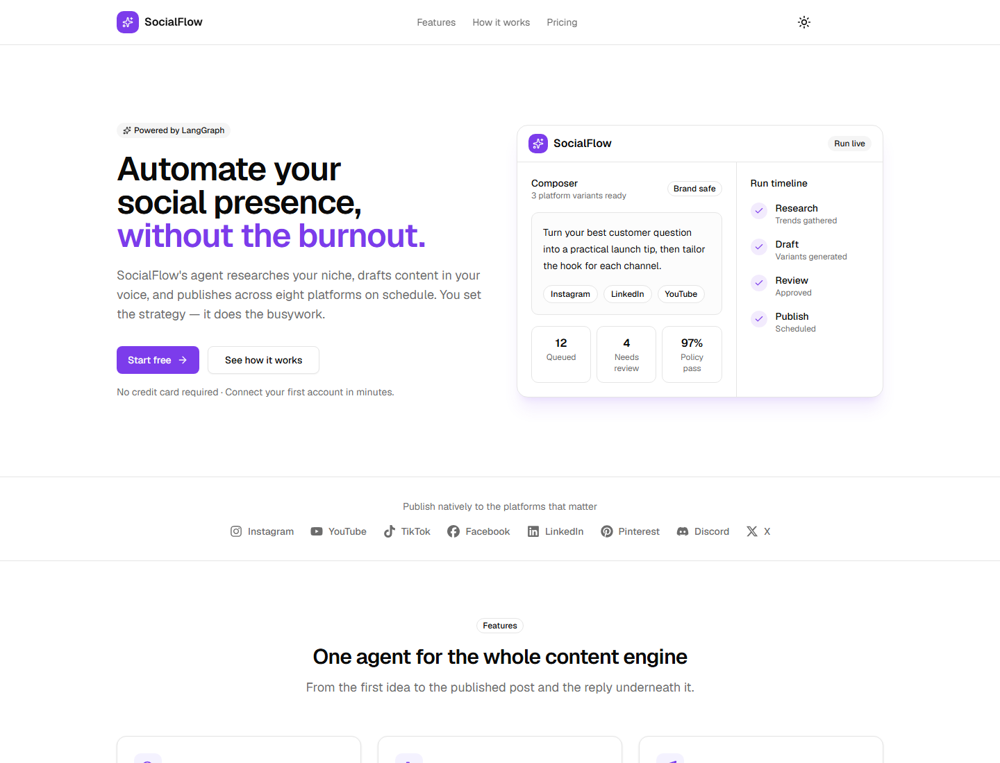

# SocialFlow

**AI-powered social content operations for research, creation, scheduling, publishing, and replies.**

## What It Does

SocialFlow helps creators and teams run a complete social-content workflow from one workspace. It researches a niche, drafts platform-tailored content, schedules posts, publishes to connected accounts, tracks activity, and responds to comments with keyword or AI-assisted replies.

## Core Workflow

1. **Research** - gather topic ideas, audience angles, and trends for a niche.
2. **Generate** - create platform-ready captions, posts, and campaign variants.
3. **Review** - approve content plans with brand-safety and usage controls.
4. **Schedule** - organize posts on a calendar and queue them for publishing.
5. **Publish** - send content to connected social channels automatically.
6. **Reply** - monitor comments and respond with rules or AI-generated replies.

## Product Highlights

- Unified composer for short-form and long-form social posts.
- Campaign planning with agent-run timelines and approval checkpoints.
- Workspace roles, quotas, and plan limits for controlled team usage.
- Media upload validation for image and video publishing.
- Calendar views, retry handling, and publishing status tracking.
- Comment automation for ongoing audience engagement.

## Supported Channels

Facebook, Instagram, LinkedIn, TikTok, Discord, YouTube, Pinterest, and X.
